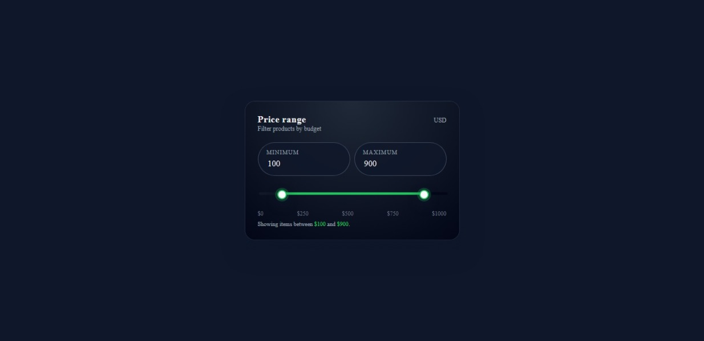

# Price Range Slider

This is a practice project acts as a practice for CSS and JavaScript.

The project features a price range slider with min and max inputs. The user can move the meter on the range slider to choose a suitable price range. Beside using the slider, the user can also use number inputs on top to better control the range.

## Screenshot

### Built with

- HTML
- CSS
- JavaScript

### What I learned
- [CSS] How to style range inputs, specifically how to overwrite default styling and combine two different range sliders into one
- [CSS] How to use gradient colors
- [JavaScript] How to calculate the range on the slider and sync the number inputs with the range input

## Author

- Zack Yang
- Frontend Mentor - [@ZackDora](https://www.frontendmentor.io/profile/ZackDora)
- Facebook - [Dương Trí Phú](https://www.facebook.com/ytp109)
